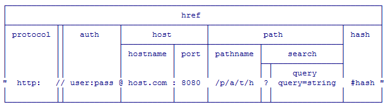

## NodeJS的安装
### 直接使用nodejs的安装包
使用注意点：不建议使用。因为nodejs更新换代太快，如果出了新的版本就重新安装一次太浪费时间。

### 使用nvm来安装
#### 优点
1. 可能同时管理多个nodejs版本
2. 更新了新的nodejs只需要知识版本号就可以通过nvm

#### 安装步骤
1. 下载nvm工具，并安装（设置两个路径：一个是nvm存放的路径，另一个是nodejs存放的路径）
2. 打开nvm，通过指令来安装node`nvm install nodejs的版本号` + 回车 可以下载对应版本的nodejs.

### nvm,nodejs,npm之间的关系
1. nvm：nodejs的版本管理工具，可以下载nodejs以及改变正在使用的nodejs的版本
2. nodejs：提供node环境，其中集成大量的核心模块
3. npm：每个版本的nodejs都自带的一个工具，他们以帮助nodejs去上传和下载新的第三方包

### nvm的常用指令
1. nvm list -> 查看当前已安装的所有nodejs版本
2. nvm install nodejs的版本号 -> 安装指定版本的nodejs
3. nvm uninstall nodejs的版本号 -> 卸载指定版本的nodejs
4. nvm use nodejs的版本号 -> 将指定的nodejs版本设定为当前使用的nodejs环境

## 什么是nodejs
### 定义
Node.js是Javascript除了浏览器之外可以运行的另一个环境(runtime)。可以为我们提供开启服务功能和提供文件读写功能。

### 特点
1. 基于google浏览器的v8引擎
2. 事件驱动、非阻塞I/O
3. 因为第二个特点，nodejs相比其它的后台语言要高效、轻量。
4. 开源并且跨平台。

## node的使用
### REPL:交互式运行环境（给开发人员的测试的模式）
1. ctrl + c 两次：退出REPL环境
2. ctrl + d 一次：退出REPL环境
3. .exit 退出REPL环境
4. ↑↓：查看RPEL的历史操作记录
5. _: 得到上一次操作的结果
6. tab（tab键）：查看nodejs中的API
7. .save fileName：以js文件的形式将当前REPL会话保存到硬盘中
8. .load fileName: 将硬盘中的js文件以REPL的形式读取出来

### 正常开发模式（执行js文件）
1. 写好一个js文件
2. 在js文件所在的位置打开powershell，输入指令node fileName.js能得到js的执行结果。
3. 也可以在sublime中安装terminal插件（ctrl+shift+p ->package controll:install -->terminal）

## nodejs的常用API
### global对象
1. `global.setTimeout(function(){},time);` -> 异步执行的方法
2. `global.setImmeditate(function(){})` -> 异步执行的方法(优先级要高于setTimeout)
3. `process.nextTick(function(){});` -> 异步执行的另一个方法（优先级比上面两个都高）
4. 全局对象中的方法在任何js文件中都可以直接使用，不需要通过require方法再单独导包。
5. 而其它非全局对象中的方法如果要使用的话需要导包（如：要使用http中的方法需要require（'http'））
6. `__dirName` -> 得到当前文件所在的路径 -> 伪全局对象
7. `__fileName` -> 得到当前文件的全路径（物理路径+文件名）
8. `process`对象
- `process.abort()` -> 立即结束js代码的运行，下面的代码不再执行
- `process.arch()` -> 得到当前运行环境所在平台
- `porcess.argv()` -> 得到当前文件的执行参数
    + 返回值为一个数组，数组中的第一个值，第二个值为默认值
    + 分别为当前repl环境的执行进程，以及当前node执行的js文件的绝对路径（__fileName）
    + 如果将来执行js文件的时候手动传入了参数，那么这些参数会按顺序被添加到argv的数组中
- `process.env` -> 得到当前操作系统中环境变量
    + 用于区别生产环境和正式环境
    + 通过执行时传入set 变量值=变量名 && node 运行程序来执行
    + powershell中不认识&&指令，必须要去cmd中执行
- `process.stdout.write()` -> 输出内容
    + `console.log`的底层其实就是通过这个方法来输出的
    + `process.stdout.write`输出的只能是字符串，并且不带换行
- `process.stdin` -> 监控输入的对象
    + `process.stdin.on('readable',function(){})` ->当输入内容敲击回车时会触发这个事件中的回调函数
    + `process.stdin.read();` -> 得到在输入回车前输入的内容（以二进制的形式得到的，如果直接输出会以buffer数组的形式输出，toString以后才会转为字符串）
9. root对象

## js的模块化
### 模块化的演变过程
1. 普通的方法的书写格式，多个人开发可能会造成变量污染 
2. 使用对象的作用域来解决变量污染问题，如果在这个对象中有一些属性不希望被外界访问到，不能实现这个效果
3. 使用函数的方式来私有化变量，每次使用的时候都需要重新创建对象
4. 使用函数的自执行模式来代替new操作，没有问题，但是要考虑到扩展性
5. 使用一个自执行函数在原来的对象上扩展方法，将来自执行的时候要进行传参，这个参数需要做一个处理（window.calc || {}）
6. 如果将来要用到第三方模块，我们需要将模块名写在自执行函数的参数上

## 第三方模块化管理工具
### [seajs](seajs.org)
#### 特点
1. Sea.js 遵循 CMD 规范
2. Node.js 一般书写模块代码
3. 依赖的自动加载、配置的简洁清晰

#### seaJS使用步骤
1. 要定义一个单独的模块
```
define(function(require,exports,module){
    function add(x,y){
        return x+y;
    }
});
```
2. 要在模板中返回一些方法/属性/对象
```
//关键字 exports/module.exports
exports.add=add;
module.exports.add=add;
```
3. 使用关键字require引入第三方模块
```
var add=require('./add.js');
//将来通过require关键字引用了其它模块以后，会返回引用模块的一个对象：exports/module.exports
```
4. 使用seajs定义好的模块
```
seajs.use('./cals/cals.js',function(obj){
    //回调函数中的obj对象指向的是当前引用的模块cals.js模块中的exprots/module.exports对象
    alert(obj.add.add(1,1));
});
```

### CMD规范(seaJS)
#### 规范明确了模块的基本书写格式和基本交互规则
1. cmd规定在define中可以传入方法，对象，字符串
2. cmd规定require用于接收第三方包提供的接口
- 拼写正确
- 不要修改
- 使用直接量
3. cmd规定exports用来向外提供模块接口
4. cmd规定module.exports用于向外提供模块的接口
5. 遵守CMD规范的模块都有一个特点：按**需要加载**特点（**懒加载**）

### AMD规范(reuqirejs)
CMD与AMD基本相同，最大的区别是CMD是懒加载，AMD是预加载

### CommonJS规范
#### nodejs与commonjs之间的关系
1. nodejs是一种服务器语言
2. commonjs是nodejs的规范

#### commonjs规范的意义
javascript本身存在的缺点：
1. 没有模块系统（不方便扩展）
2. 标准库较少，对于文件系统，I/O流等常见的需求没有标准的API
3. 没有标准接口，缺少如：WEB胳器，数据库的统一接口
commonjs规范：
1. javascript必须像后台语言一样具有拥有开发大型web服务器的能力
2. commonjs覆盖了：二进制、字符集编码、I/O流、web服务器.....
3. 规范了模块与模块之间的引用关系

## 核心模块
### 什么叫核心模块
commonjs规定的好的功能在nodejs实现了，这样的一些模块我们叫做核心模块。也就是说nodejs中所有文档中给出的api都是核心模块，而我自己写的模块我们称为用户模块

### 核心模块Path
- 作用：用于帮助程序员来操作硬盘上的路径。
- 当引用核心模块的时候直接require('模块名'),不需要加任何路径或者后缀。

#### Path中的常用API
1. `dirname(路径)`获取传入路径中文件的路径
2. `basename(路径)`如果不传入任何参数：直接获取到传入路径中文件的全名称（文件名+扩展名），如果传入文件对应的后缀，会将后缀名去掉（传错与不传相同）
3. `extname(路径)`获取传入路径中文件的扩展名
4. `join()`将多个路径组装成一个路径，不管路径是否标准，路径中存在../这个方法也可以识别。
5. `parse(路径)`返回值是一个对象，将传入的路径进行拆分，将路径的各个部分以对象属性的形式返回
6. `format(路径对象)`返回一个字符串，将一个路径对象传入，返回一个路径的字符串
7. win下的路径最好加上反斜杠，max系统下不用关注
8. `delimiter`分隔符：如果在win系统下为';',在其它系统下为':'
9. `isAbsolute(路径)`判断一个路径是否是一个绝对路径
10. `normalize（路径）`将一个非标准路径转换成一个标准路径
11. `relative（form路径，to路径）`form路径到to路径要的查找过程
12. `sep`在win系统下得到'\'分隔符，在其它系统下面得到'/'分隔符
13. `posix`所有的路径方法的一个集合

### 核心模块url(用于操作请求的路径)
协议+用户名和密码+服务器的ip地址+端口号+请求地址+页面参数+页面hash值

1. `url.parse(urlString)`将一个url字符串转化为一个url对象
2. `url.format({...})`将一个url对象转换为一个字符串
3. `url.resolve(from,to)`将两个url组合起来

### 核心模块querystring(对请求参数的处理)
1. `querystring.parse();`将一个参数字符串转为对象
2. `querystring.stringify();`将一个对象转为字符串
3. `querystring.escape(url)`将url中的汉字进行转码
4. `querystring.unescape(url)`将url中被转码的汉字重新转为汉字

### nodejs引包的过程
1. 当nodejs执行到require('包名')的时候会先将这个包名当作核心模块来识别
2. 但是发现这个包并不是核心模块时，会自动去node_modules文件中查找文件名为这个包名的文件夹
3. 如果找到这个包，且包中有一个叫做package.json的文件，nodejs会根据package.json中的main属性去找到对应的入口文件
4. 如果没有package.json文件就直接去包中找一个名称为index.js的模块，并加载出来
5. 如果都没有找到，就报错

### package.js文件(给当前包设置一些重要参数)
- `npm init -y`
```
{
/*
1. 名字里不要再包含"js"和"node"
2. 要符合http url的一般命名规则，不能包含url非法字符，也不能以.和_开头
3. 名字也将作为require()命令的参数
4. 先检查下有没有重名, 并且字母只能全部小写
*/
"name": "js",//设置当前包的名称
"version": "1.0.0",//设置当前包的版本
"description": "",//设置当前包的描述信息
"main": "abc.js",//设置当前包的出口文件
"scripts": {//这个设置可以使当前包调用NPM一些命令脚本，封装一些功能
"test": "echo \"Error: no test specified\" && exit 1"
},
"keywords": [],//设置当前包的关键字
"author": "",//当前包的作者
"license": "ISC"//设置当前包的许可证书版本（BSD-3-Clause,MIT,ISC）
}
```

### 符合CommonJS规范的包
1. 一个package.json文件应该存在于包顶级目录下（必须）
2. 二进制文件应该包含在bin目录下(非必须)
3. JavaScript代码应该包含在lib目录下（必须）
4. 文档应该在doc目录下（非必须）
5. 单元测试应该在test目录下（非必须）  
6. 使用说明放在README.md文件，这个文件必须放在包的顶级目录（必须）

### 通过NPM安装和上传包
#### 上传
1. 创建好一个标准结构的包（注意:一定要满足包的要求），并且在package.json文件中设置好一些参数。
2. 去npmjs注册一个账号（登录之后点击图像会弹出下拉框，选择profile，会打开记录发布包的历史记录）
3. 在要发布的文件夹下打开CMD，执行发布指令
- `npm adduser`:根据引导，依次输入用户名，密码，以及注册邮箱就行了
- `npm publish`：上传

### require加载规则
1. require无论是核心模块还是文件模块都优先从缓存加载（可以解决一个文件多次引用一个文件模块而反复加载的问题）
2. 在window中加载一个文件模块要使用./或者../开头（如果不加后缀，nodejs会当作用核心模块或者是包来解析）
3. 在mac和linux中以/加载是加载一个绝对路径的文件模块，而在window下/表示当前require函数所在文件所在的目录的盘符
4. 一个文件模块可以不写扩展名,require()会自动依次按照.js .node .json的顺序进行补齐后加载，如果三个扩展名都没有，则当做目录或者包来加载。如果目录或者包都没有，则报错。所以如果不加后缀，将来如果一个文件返回的是json，那么它的加载性能会慢一点。
5. 加载一个包，依次按照module.paths数组中的路径，加载传入的包名，如果有，就加载出；如果没有，报错
6. 包加载完毕以后，如果有package.json文件，就去找其中main属性对应的出口文件
7. 如果没有，就找默认文件index.js

### 调试nodejs
1. 使用console.log()
2. `node debug a.js`nodejs的自带调试器
3. 使用webstorm调试
4. 使用visual stdio调试
- 安装vsCode，并且通过vscode打开要调试的文件所在的文件夹
- 点击F5,选择nodejs的打开方式，这时vsCode会打开一个lanuch.json，修改其中"program"属性，改为"${workspaceRoot}/文件名.js"
- 可以查看文件的五个全局对象以及添加监控文件中变量的值 

## es6语法
### 开启严格模式
```
”use strict”
```
1. 消除Javascript语法的一些不合理、不严谨之处，减少一些怪异行为;
2. 消除代码运行的一些不安全之处，保证代码运行的安全；
3. 提高编译器效率，增加运行速度；
4. 为未来新版本的Javascript做好铺垫。

### 定义变量：let （类似于var）
1. var声明的变量会有变量提升
2. var没有块级作用域
3. var可以多次重复定义一个变量

### 定义常量const
1. 值不能再改变
2. 常量具有块级作用域
3. 不要在块中申明常量
4. 没有变量提升，先声明后使用
5. 不可以申明同名的常量
6. 一定要赋初始值，否则报错
7. 如果声明的是对象，对象的地址不能改变，但是可以改变其内部的属性。

### 字符串的扩展
1. `Includes()`返回布尔值，表示是否找到了参数字符串
2. `startsWidth(str[,num])`返回布尔值，表示是否在原字符串开头找到了参数字符串
3. `endsWith(str[,num])`返回布尔值，表示参数字符串是否在原字符串的结束位置
4. `repeat(num)`将调用的字符串重复num次

### 模板语法：`模板字符串`
结构：\`模板内容${code}\`

### 箭头函数:()=>{}
```
arr.each(function(m,n){
    console.log(n)
});
```
```
arr.each((m,n)=>{console.log(n);});
```
```
arr.each((m,n)=>console.log(n));
```
```
arr.each(n=>console.log(n))
```
1. 箭头函数没有自己的this，函数体内部写的this,会顺着作用域去找最近真实存在的this
2. 箭头函数内部的this是定义时所在的对象，而不是使用时所在的对象，并且不会改变。
3. 箭头函数不能作为构造函数，会报错
4. 箭头函数中不存在arguments，箭头函数中的argument指向的是外层的arguments

## 文件读写核心模块File System(fs)
### Buffer对象
#### 使用buffer对象
1. 创建`var buffer = new Buffer(5);`
2. 清空`buffer.fill(0);`
3. 写入内容`buffer.write(‘我ABCD’);`
4. 将数组转为字符串`buffer.toString();`
5. 按需分配数组的长度`let buf = new Buffer(“你好世界”);`

#### Buffer常用操作
1. `new Buffer(参数)`:创建一个Buffer对象
2. `buf.wirte()`：写入内容
3. `buf.length`：获取buffer对象中数据的长度
4. `buf.slice`:用来获取指定位置的指定长度数据
5. `buf.toString(编码)`：将二进制数据转换成指定编码的字符串，默认是utf8
6. `Buffer.isEncoding(编码)`：判断当前编码格式在nodejs中是否支持。

### 操作目录
#### 创建文件夹：mkdir
1. 引用核心模块`const fs = require(“fs”);`
2. 创建文件夹`fs.mkdir(“./abc/a”,function(err){})`

#### 删除文件夹：rmdir
1. rmdir只能移除空文件夹

#### 判断一个目录是否存在
`fs.exists(path,(exists)=>{})`

### 操作文件
1. 写文件`fs.writeFile(file,data,[,opionts],(err)=>{})`
2. 追加文件`fs.appendFile(path,data,(err)=>{});`
3. 读文件`fs.readFile(path,(err,content)=>{})`
4. 文件重命名（改）`fs.rename(path,path,(err)=>{});`
5. 删除文件（删）`fs.unlink(path,(err)=>{})`
6. 监控文件`fs.watchFile(fileName,{persistent:true,intrval:50},(curr,prev){})`
- curr：表示的是最新文件的版本
- prev：表示的是上一次修改之前的版本
- callback: 文件发生修改时候会执行回调函数。
- 如果要读取文件以后做其它的事情一定不能把代码放到回调函数之外，不然还没有读完操作就完成了

### 实现大文件的读写
1. 创建读文件流`let rs =  creatReadStream(path,)`
2. 创建写文件流`let ws =  creatWriteStream(target)`
3. 添加数据读取监听：`rs.on(“data”,(chunk)=>{ws.write(chunk)})`
4. 添加事件结束事件`rs.on(‘end’,()=>{})`
5. 还可以通过`创建读流`，`创建写流`，`调用读流的管道方法写入写流:rs.pipe(ws);`

## nodejs的特点
### 非阻塞I/O模型(异步)
当使用nodejs去读取文件时，如果文件过大，就让程序分两个部分来工作：一个部分继续去读取文件，另一个部分继续执行下面的程序。这种方式来读取文件的话，既不会影响文件的读取，又不会影响下面代码的执行。这种文件读取文件的方式我们叫做非阻塞式I/O模型。
### 事件驱动
通过nodejs的fs核心模块给文件设置一个监听事件，文件就处于补监听状态了，一旦文件被修改了，就会触发监听设置的回调函数，当回调函数处理完毕后返回监听状态，并处于等待事件状态。所以将来只要设置一个事件，只要满足事件的触发的条件，事件就会执行，执行以后再回到等待事件状态。
### 事件驱动的应用
由于淘宝服务器在任何时候都可能被用户访问到，为了防止请求被遗漏，淘宝的服务器需要开启一个监听事件，而这个监听事件应该满足的状态是：如果有请求过来，服务器就处理请求，如果没有请求过来，服务器就等待请求。而这个特点就事件驱动的核心思想。今天我们来利用nodejs的事件驱动写一个服务器。

## net核心模块
### 使用net创建一个服务器的步骤
1. 创建一个服务器对象
- `var socketServer = net.createServer();//建议第一种`
- `var socketServer = new net.server();`
2. 给socketServer开启一个监听事件
- `socketServer .on(“connection”,(socket)=>{});`
3. 监听端口
- `socketServer.listen(端口号，ip地址);`

### 使用net创建一个客户端的步骤
1. 设置要连接的服务器的ip和端口号
```
let ip = ‘ip地址’;
Let port = 8080;
```
2. 连接服务器
```
Let socket = net.createConnection(prot,ip,()=>{});
```
3. 接收来自服务器的数据
```
Socket.on(“data”,(content)=>{})
```

## HTTP协议
### 创建服务器的方法
1. 创建服务器`let server = http.createServer();`
2. 监听浏览器的请求`Server.on(“request”,(req,res)=>{});`
3. 监听`Server.lisen(port,ip,()=>{});`

### req对象
- headers属性:获取浏览器请求报文头中的值
- rawHeaders:获取浏览器请求报文头中的值
- httpVersion：当前请求的http协议的版本,通常都是 HTTP1.1
- method: 获取当前浏览器请求的方法（get,post）
- url：浏览器请求服务器的页面路径 

### res对象
- setHeader()：设置响应报文头：
- 如果没有设置文件头的类型将来数据响应到浏览器为乱码，需要设置属性：’Content-Type’,’text/html;charset=utf8’;。（告诉浏览器，这段返回的数据的类型为文本类型,并且数据字符集为utf-8）
    + Content-Type常用属性为：
        * text/plain:文件类型
        * application/x-png：png图片
- end():结束响应的标志
    + 服务器只有执行了end方法浏览器才认为服务器响应完毕，所以将来服务器做完操作以后一定要加上end方法。
- write():可以向浏览器中输入一些内容。

### 异常捕获
```
try {
    逻辑代码
    //当逻辑代码运行异常时，会自动触发catch(err)
    //err:指当前错误的一异常信息
}catch(err){
    处理异常代码可以为：
    1）console.log(err);//将错误信息打印出来，方便程序查看（不会响应程序正常运行）
    2）Throw err;//报错，类似于没有处理（程序无法正常运行）
    3）为空：什么都不写出现错误后不会响应程序运行
    4）一般情况下会将错误信息写入一个文本文件中（我们把这个文件叫做日志文件。）
}
```

## 小型服务器思路
1）创建好服务器
2）设置好模块，给模板中填入占位
3）浏览器请求服务器时，判断当前请求的是否是index.html页面
4）读取index.html模板中的内容
5）读取data.json中的数据，拼接成li标签，替换 模板中的$(lis}占位符
6）将完整 的html字符串响应回去

## 模板
1）安装
2）创建一个模板文件
3）将要设置的占位以模板文件的语法加入到模板文件中
```
{{#each(array)}}
<li> {{this}}  </li>
{{/each}}
```
4）使用模板：
```
xtpl.renderFile('./tmp.html',{array:[1,2,3,4,5]},(err,content)=>{
    //content其实就是结合tmp.html和{array:[1,2,3,4,5]}生成以后的    最终html代码
    // console.log(content);
    res.setHeader('Content-Type','text/html;charset=utf8');
    res.end(content);
});
```

## express框架的使用


