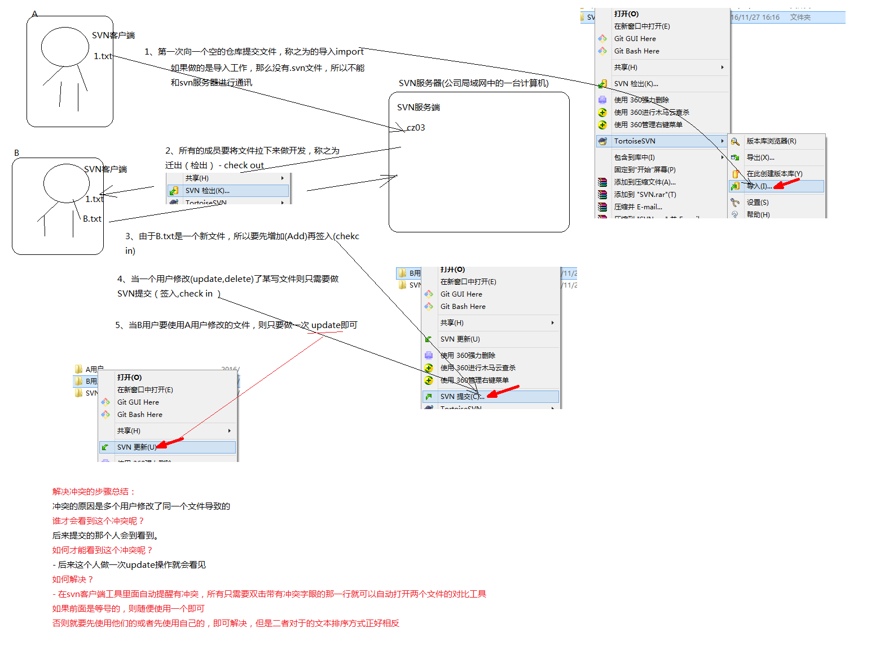

### SVN使用
1. 公司局域网中有一台计算机是我们的SVN服务端
2. 我们工作的电脑是客户端，我们需要向服务端进行提交
3. 服务端VisualSVN_219
4. 安装VisualSVN-Server-2.1.9.msi
5. 安装的时候要注意将我们的【Server Port】改成现在使用的本地的端口
6. 其他的都是默认选择
7. 安装客户端，先装安装包再安装中文包
8. 安装好客户端后鼠标右键可以看到一个小乌龟
9. 安装好后再设置里面有个语言，选择我们的中文
10. 设置完成之后会跳转到我们的服务器的管理工具中
11. 我们在管理工具中建立我们的仓库
12. 这个仓库中设置访问权限，创建一个用户，设置用户名和密码
13. 这个用户还是游离的，没有任何的操作权限
14. 在我们新建的仓库中右键有一个【Properties】【add】，将用户选中，再设置权限
15. 将我们的文件添加到仓库中去
16. 产品经理第一次向一个空的仓库提交文件，称之为导入import
17. 在对应的文件夹右键打开小乌龟【导入】
18. 里面的url地址就是我们刚刚新建的仓库的地址
19. 添加提交说明，提交，需要用户名和密码
20. 我们提交后有一个版本信息的，在仓库上右键【Copy URL to Clipboard】，在浏览器的url栏中访问
21. 第一次提交完成之后要通知所有的组员将项目down下来做开发
22. 所有的组员要将文件拉下来做开发，称之为迁出(检出、check out)
23. 我们再次创建一个用户，一样也要添加到项目中去，授予权限
24. 用户要将项目检出，在他自己的电脑上有一个文件夹放置他的代码
25. 右键【SVN检出】，选择检出的程度或是版本，一般【全递归】
26. B用户工作写文件，要将这个文件加入到SVN服务器
27. 由于新建了文件，所以要先增加再签入(check in)
28. 返回到B用户的文件夹右键【增加】，将文件加入到本地
29. 我们还需要进行提交，右键【SVN提交】，添加提交信息
30. A用户做了导入，那么久没有.svn文件所以不能和我们的SVN服务器进行通讯
31. A用户可以将原来的文件删除，也要检出
32. 就将自己的和B用户的都拿下来了，A用户对文件进行修改，只需要对文件进行提交就行
33. 当一个用户修改(update、delete)了某些文件只需要做SVN提交就行(check in，签入)
34. A用户修改了文件，B用户想要使用，直接右键【更新】就可以了
35. 当A用户修改了别人的文件，B用户对自己的文件进行了操作，都在哎同一行，A用户先提交了，B用户没有更新直接提交，就会报一个错误
36. 提示文件或是目录已经过时，请先更新
37. 双击提示的错误信息，双击不了就点确定，会弹出一个窗口，选择【升级】
38. 再次双击错误就会将两个有冲突的文件对比的显示出来
39. 双方进行协商之后如果是等号就点左键想下面拖，再点击右键【使用此文本】之类的解决方式
40. 要将文件合并，【先使用他们的文本块】，人家的在前我的在后，完成以后点击【标记为已解决】，完成时候提交
