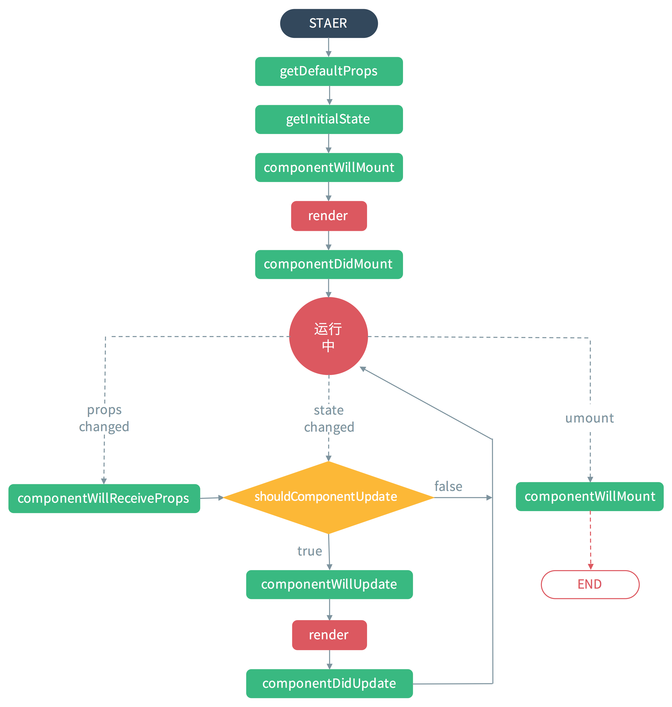

### webpack
1. `npm install -g webpack`
2. 配置webpack.config.js文件，文件的配置类似于gulp
3. 通过配置文件中的entry获取到文件，output将文件输出
4. webpack通过loader（加载器）和plugin（插件）处理文件

### 文档地址
  - [官网](http://facebook.github.io/react)
  - [中文网](http://reactjs.cn/react)
  - [React中文社区](http://react-china.org/)

### 在线编辑工具
  - [使用js语法书写](https://jsfiddle.net/reactjs/5vjqabv3/)
  - [使用jsx语法书写](https://jsfiddle.net/reactjs/69z2wepo/)

### 真实案例
  - http://info.smartstudy.com/
  - http://www.kongkonghu.com/choice

### React中4个主要概念
1. VirtualDOM
2. React组件
3. JSX语法
4. Data Flow(单向数据流)

### React快速开始
1. 安装
- `npm install react --save-dev` // 负责创建组件
- `npm install react-dom --save-dev` // 渲染组件到页面
- 如果要使用webpack开发那么还需要下载webpack工具
    + 1. ` npm install babel-loader --save-dev `
    + 2. ` npm install babel-core --save-dev `
    + 3. ` npm install  babel-cli babel-preset-react  --save-dev`
2. 开发工具
- [在谷歌应用商店的链接](https://chrome.google.com/webstore/detail/react-developer-tools/fmkadmapgofadopljbjfkapdkoienihi)

### 开始编写react代码
1. 确定react渲染的位置
```
<div id="myDiv"></div>
```
2. 引用reactdom
```
import ReactDOM from 'react-dom'
```
3. 将写好的组件渲染到界面上
- 参数：1组件的内容，2需要将你的组件渲染的位置
```
ReactDOM.render(
    <h1>hello react</h1>,
    document.getElementById('myDiv')
);
```
4. 利用webpack将JSX转换成浏览器可以识别的代码
```
module.exports={
    entry:'./main.jsx',
    output:{
        path:__dirname,
        filename:'bundle.js'
    },
    module:{
        loaders:[
            {
                test:/\.jsx?$/,
                loader:'babel-loader',
                query:{
                    presets:['react','es2015']
                }
            }
        ]
    }
}
```
5. 如果用webpack打包不成功，可以使用一个翻译工具browser.js
6. 创建hello React组件
```
//类名一定要大写
class Hello extends React.Component{
    //当前组件所需要渲染的内容
    render(){
        //return后面一定要紧跟标签，如果要换行就一定要用小括号将标签包裹起来
        return (
            <div>
                {/*注释*/}
                <h1>hello react</h1>
                }
            </div>
        )
    }
}
ReactDOM.render(
    <Hello></Hello>,
    document.getElementById('myDiv');
);
```
7. state创建对应的参数
```
class Hello extends React.Component{
    constructor(){
        super();
        //初始化参数通过state来创建对应的参数
        this.state={
            number:100,
            name:'这是通过state方式创建的参数'
        }
    }
    render(){
        //如果想要修改对应的参数，不推荐
        this.setState(
            number:200
        );
        return (
            <div>
                <h1>hello react</h1>
                <h2>{this.state.name}</h2>
                <h3>{this.state.number}</h3>
                {/*
                    在react中的input标签如果需要修改value中的参数，需要使用defaultValue来将默认参数显示出来
                */}
                <input type="text" defaultValue={this.state.name} />
            </div>
        )
    }
}
ReactDOM.render(
    <Hello></Hello>,
    document.getElementById('myDiv');
);
```
8. 初始化参数通过state创建时，里面有html标签，会原样输出
9. 将要转义的前面加上
```
<div dangerousliSetInnerHTML={{__html:this.state.myh1}}>
</div>
```
10. 添加样式，在state里面添加
```
//react样式通过style方式设置或是通过className设置样式
myStyle:{
    'background-color':'red'
}
//在渲染的时候直接将样式绑定在标签上
<p style="{this.state.myStyle}">red</p>
//TODO
```
11. props的意思从外部传递过来内容通过props接收然后输出
```
<p style={this.state.myStyle}>{this.props.name}</p>
//TODO
```
12. 事件调用
```
click(){
    console.log('触发');
}
//在渲染函数中直接绑定点击事件，在事件调用的方法后面不需要加小括号
<input type="button" value="ClickMe" onClick={this.clickMe}>
```
13. 双向数据绑定
```
inputValueChange(){
    //input修改后的值this.refs.inputEdit.value
    //当前的name值this.state.name
    //修改当前name
    this.setState({
        //name:this.state.name+'?'
        name:this.refs.inputEdit.value
    });
}
//bind绑定当前this的指向
<input refs='inputEdit' type="text" defaultValue={this.state.name} onChange={this.inputValueChange.bind(this)}>
{this.state.name}
```

### 直接渲染页面
```
<div id="myDiv"></div>
```
```
<script src="js/react.js"></script>
<script src="js/react-dom.js"></script>
<!--翻译工具-->
<script src="js/browser.min.js"></script>
<!-- 创建script时候需要添加type="text/babel" -->
<script type="text/babel">
  ReactDOM.render(
        <h1>hello react</h1>,
        document.getElementById('myDiv')
    );
</script>
```

### 通过创建组件渲染
```
<!-- es5写法 -->
var Hello=React.createClass({
    render:function(){
        return (<div><h1>hello react</h1></div>)
    }
});
ReactDOM.render(
    <Hello></Hello>,
    document.getElementById('myDiv')
);
```
下面这种方式通过翻译工具browser.min.js不能解析，在jsx中通过webpack转义后可显示
```
class Hello extends React.Component{
  constructor(){
     super();
  }
  render(){
    return (<h1>es6</h1>)
  }
}
ReactDOM.render(
  <Hello></Hello>,
  document.getElementById('myDiv')
)
```

### 组件生命周期*
1. 组件的生命周期分成三个状态
- Mount 已插入真实DOM
- Update 正在被重新渲染
- Unmouting 已移出真实DOM
2. 状态处理函数

- React 为每个状态都提供了两种处理函数，will函数在进入状态之前调用，did 函数在进入状态之后调用，三种状态共计五种处理函数。
    + componentWillMount() //加载之前
    + componentDidMount() //已经在dom中
    + componentWillUpdate(object nextProps, object nextState) //将要更新
    + componentDidUpdate(object prevProps, object prevState) //已经更新
    + componentWillUnMount() //已经加载完成
    
- 此外，React 还提供两种特殊状态的处理函数。
    + componentWillReceiveProps(object nextProps)//已加载组件收到新的参数时调用
    + shouldComponentUpdate(object nextProps, object nextState)//组件判断是否重新渲染时调用，不会修改后立马被监视到，因为如果有多次渲染他会选最后一次渲染结果



### react转义
```
import React from 'react'
import ReactDOM from 'react-dom'
class Hello extends React.Component{
    constructor(){
        super();
        //初始化参数通过state来创建对应的参数
        this.state={
            myh1:'<h1>myh1</h1>'
        }
    }
    render(){
        return (
            <div dangerouslySetInnerHTML={{__html:this.state.myh1}}></div>
        )
    }
}
ReactDOM.render(
    <Hello></Hello>,
    document.getElementById('myDiv')
);
```

### 样式的设置
```
import React from 'react'
import ReactDOM from 'react-dom'
class Hello extends React.Component{
    constructor(){
        super();
        //初始化参数通过state来创建对应的参数
        this.state={
            myh1:'<h1>myh1</h1>',
            myStyle:{
                'background-color':'red'
            }
        }
    }
    render(){
        return (
            <div>
                <p style={this.state.myStyle}>red</p>
                <p className="blue">blue</p>
            </div>
        )
    }
}
ReactDOM.render(
    <Hello></Hello>,
    document.getElementById('myDiv')
);
```

### 组件嵌套使用
```
import React from 'react'
import ReactDOM from 'react-dom'
class Hello extends React.Component{
    constructor(){
        super();
        //初始化参数通过state来创建对应的参数
        this.state={
            myh1:'<h1>myh1</h1>',
            myStyle:{
                'background-color':'red'
            }
        }
    }
    render(){
        return (
            <div>
                <p style={this.state.myStyle}>{this.props.name}</p>
            </div>
        )
    }
}
class Main extends React.Component{
    constructor(){
        super();
    }
    render(){
        return (
            <div>
        <h1>主组件</h1>
        <Hello name="这是从主组件传递过来的参数"></Hello>
      </div>
        )
    }
}
ReactDOM.render(
    <Main></Main>,
    document.getElementById('myDiv')
);
```

### 双向数据绑定
```
import React from 'react'
import ReactDOM from 'react-dom'

class Main extends React.Component{
    constructor(){
        super();
        this.state={
            name:'初始值'
        }
    }
    inputValueChange(){
        this.setState({
            name:this.refs.inputEdit.value
        });
    }
    render(){
        return (
            <div>
                <input ref="inputEdit" type="text" defaultValue={this.state.name} onChange={this.inputValueChange.bind(this)} />
                {this.state.name}
      </div>
        )
    }
}
ReactDOM.render(
    <Main></Main>,
    document.getElementById('myDiv')
);
```